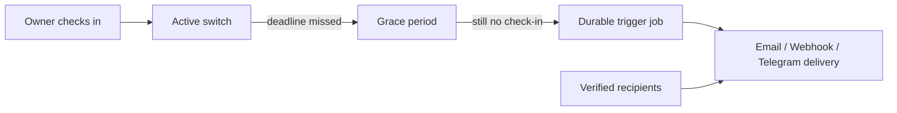
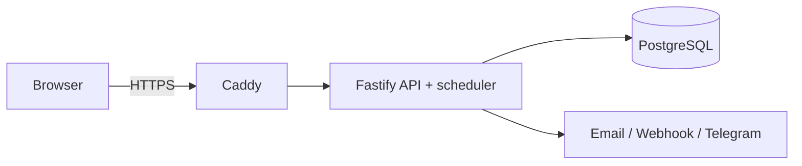

# Heartbeat Vault

Heartbeat Vault is a self-hosted dead-man's-switch service. You encrypt a payload, choose verified recipients and delivery channels, then check in on a schedule. If you miss the deadline and grace period, the service releases the configured material.

> **Important:** this is a safety tool, not a guarantee of a real-world outcome. Treat recipients, delivery channels, the host, and backups as security-critical choices. See [Security](docs/SECURITY.md) and [Threat model](docs/THREAT_MODEL.md) before storing sensitive material.

## How it works



1. Create a switch with a heartbeat interval and grace period.
2. Add recipients; they must accept their invitation before the switch can arm.
3. Store a payload. It is encrypted before the API writes it to PostgreSQL.
4. Arm the switch and check in before each deadline.
5. A missed deadline enters grace. Only after grace expires does the scheduler create delivery work.

The default behavior is **fail-safe**: on database failure, clock uncertainty, or recovery after downtime, Heartbeat Vault holds rather than releasing immediately. A `fail_deadly` policy is available only with explicit confirmation; understand its availability risk before choosing it.

## Architecture



The standard profile runs Caddy, the API/scheduler, and PostgreSQL in Docker Compose. PostgreSQL is private to the Compose network; Caddy is the public boundary. Read [Architecture](docs/ARCHITECTURE.md) for the full runtime and data-flow design.

## Quick start

Prerequisites: Docker Engine with Compose v2, `curl`, and `openssl`.

```bash
git clone <your-repository-url> heartbeat-vault
cd heartbeat-vault
./install.sh install
```

The installer creates a restricted `.env`, generates placeholders it recognizes as insecure, starts the stack, and prints a one-time setup URL and token. Open that URL, create the first administrator, and store recovery information securely. Do not place the setup token in chat, source control, or a ticket.

Check the stack at any time:

```bash
./install.sh status
```

The default LAN profile exposes Caddy at loopback ports `18080` and `18443`; values can be changed in `.env`. The default certificate uses Caddy's internal CA, so a browser may require a one-time trust step on a LAN.

## First switch guide

1. Sign in as the administrator or an invited user.
2. Create a switch, choosing an interval, grace window, and delivery mode.
3. Add one or more recipients with email, webhook, or Telegram delivery details.
4. Have at least one recipient accept their invite.
5. Store the payload. Use a non-sensitive test payload first.
6. Arm the switch. The application blocks arming without an accepted recipient and payload.
7. Check in periodically. You can disarm or cancel as appropriate before release.

For channel-specific security guidance, see [Delivery channels](docs/DELIVERY_CHANNELS.md). Email, webhooks, and Telegram should not be considered confidential payload storage; an encrypted blob plus separately communicated key material is safer where confidentiality matters.

## Configuration and deployment profiles

Copying `.env.example` manually is supported, but `./install.sh install` is safer because it creates real values for known placeholders and applies restrictive permissions.

| Setting                   | Purpose                                                                                               |
| ------------------------- | ----------------------------------------------------------------------------------------------------- |
| `MASTER_KEY`              | Server-side key-encryption key for stored payload envelopes. Keep it secret and backed up separately. |
| `SESSION_SECRET`          | Session security material.                                                                            |
| `POSTGRES_PASSWORD`       | PostgreSQL application password.                                                                      |
| `BACKUP_ENCRYPTION_KEY`   | Enables encrypted installer backups; without it backups are explicitly warned as unencrypted.         |
| `HTTP_PORT`, `HTTPS_PORT` | Loopback Caddy ports in the base Compose profile.                                                     |
| `APP_ENV`                 | Environment indicator used by verification policy.                                                    |

The shipped profile is **standard**: Caddy, API/scheduler, and PostgreSQL. A Vault/OpenBao hardened profile is intentionally deferred in v1; the installer rejects it instead of implying it exists. See [ADR-007](docs/adr/007-hardened-openbao-vs-vault.md).

## Key management and backups

Payloads use per-secret encryption keys wrapped by a versioned `MASTER_KEY`-derived KEK. Losing the key can make payloads unrecoverable; exposing it can allow a compromised running host to decrypt payloads. Keep a protected, separate copy of necessary keys. This is encryption at rest, **not** zero knowledge.

```bash
./install.sh backup
./install.sh restore backups/backup-YYYYMMDDTHHMMSSZ.sql.gz --yes
./install.sh upgrade
```

Set `BACKUP_ENCRYPTION_KEY` before making real backups. Test restore in an isolated environment. `restore` overwrites the current database and deliberately requires `--yes`.

## Verify a deployment

```bash
scripts/verify-security.sh
scripts/verify-security.sh --json
```

The verifier is read-only and never prints secret values. Exit `0` means no FAIL results; WARN results need review. A new installation normally warns until bootstrap is complete, a payload is stored, and backup encryption is configured. Full details are in [Operations](docs/OPERATIONS.md).

## FAQ

### Does Heartbeat Vault protect against a compromised server?

Not fully. The server holds the v1 KEK, so a capable attacker controlling the running host can obtain plaintext. The encrypted database is still useful against a database-only theft or separately stored backup theft. See [Security](docs/SECURITY.md).

### Will it always release when I fail to check in?

No. It intentionally holds during infrastructure or clock uncertainty. Delivery providers and recipient endpoints can also fail. This reduces false releases but cannot guarantee delivery.

### Can I expose it publicly?

Yes only after you deliberately configure public TLS/DNS and harden host operations. The standard Compose file binds to loopback by default. The `--tls le` and `--tls byo` installer modes explain the required manual Caddy setup.

### Is the hardened profile available?

No. It is an ADR-backed future direction, not a v1 feature or a fallback for the standard deployment.

## Responsible use and legal notice

Use this software only for material you have the right to store and deliver, and only to recipients who have agreed to participate. Review local laws, contractual duties, privacy obligations, export controls, estate rules, and any professional confidentiality requirements before relying on automatic delivery. Do not use the service to evade lawful process, threaten others, distribute unlawful material, or create a false expectation of emergency response.

Heartbeat Vault is provided as software, not legal, medical, security, estate-planning, or emergency-response advice. Test your workflow with non-sensitive data, maintain independent backups and contact plans, and never make someone’s safety depend solely on an automated release.

## Development

See [CONTRIBUTING.md](CONTRIBUTING.md) for local setup, test requirements, and security contribution rules. API endpoints are described in [docs/API.md](docs/API.md).
