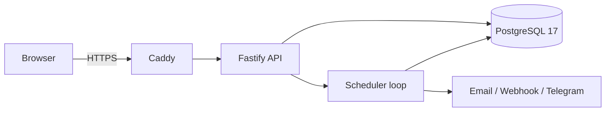

# Architecture

Heartbeat Vault is a self-hosted dead-man's-switch service. An owner stores an encrypted payload, assigns verified recipients, and keeps a switch alive by checking in. The scheduler releases only after the configured deadline and grace period have both elapsed.

## Runtime topology

The standard Docker Compose profile runs Caddy, the API/scheduler image, and PostgreSQL on an internal `app_net` network. PostgreSQL has no host port. Caddy is the only published service and binds to loopback in the base compose file. The API image runs as the non-root `node` user. Images used by Compose are digest-pinned.

Caddy terminates TLS, applies browser security headers, and proxies to the API. The default Caddy configuration uses its internal CA for LAN use. Public ACME and bring-your-own certificate deployment require the documented Caddy configuration change; the installer intentionally does not pretend that those modes are automatic.

## Repository layout

- `apps/api` — Fastify HTTP API, auth, switch lifecycle, scheduler, trigger engine, and delivery dispatcher.
- `apps/web` — React browser application.
- `apps/e2e` — Playwright browser journey and Mailpit integration checks.
- `packages/crypto` — envelope encryption, rotation, KDF, Shamir, and known-answer tests.
- `packages/db` — PostgreSQL migrations, seed/bootstrap support, and test database helpers.
- `packages/channels` — email, webhook, and Telegram delivery adapters.

The workspace uses pnpm and Turborepo. PostgreSQL is both the system of record and the durable queue; v1 has no Redis or RabbitMQ dependency. See [ADR-001](adr/001-monorepo-pnpm-turborepo.md) and [ADR-002](adr/002-postgres-as-queue.md).

## Data and job flow

PostgreSQL stores users, sessions, invites, recipients, switches, sealed payloads, heartbeats, durable waits, trigger jobs, delivery jobs, dead-letter jobs, scheduler heartbeats, audit events, and application configuration. Timestamps are UTC and the database clock is authoritative for scheduler decisions.

The API stores a payload only after encrypting it. It writes the encrypted envelope fields—not plaintext—to `sealed_payloads`. A switch cannot arm unless it has a stored payload and at least one accepted recipient. Arming records the heartbeat start and next deadline transactionally.

The scheduler runs in the API process. Its recovery and dispatch path promotes overdue durable waits, materializes due trigger work, reclaims expired leases, claims work with PostgreSQL locking, processes it idempotently, and dispatches delivery work. Retry attempts use backoff and terminal failures move to the dead-letter queue rather than disappearing. The scheduler records a heartbeat so a restart can recognize downtime and extend affected timers rather than releasing during an uncertainty window.

This is deliberately fail-safe: database failure, clock uncertainty, or recovery after downtime holds delivery rather than releasing immediately. A per-switch `fail_deadly` policy exists only with typed confirmation at arming; its operational implications are documented in [SECURITY.md](SECURITY.md).

## Encryption boundary

Each stored payload receives a random data-encryption key (DEK). The DEK is wrapped under a versioned key-encryption key (KEK), and the payload is encrypted with XChaCha20-Poly1305. The envelope carries authenticated associated data that binds it to the tenant and switch. The API retains the server-side KEK in v1, so this is encryption at rest, not a zero-knowledge system.

Key versioning supports a controlled rewrap process: new writers use a new KEK version, existing envelopes can be rewrapped in batches, and old versions remain decryptable until no rows require them. A DEK compromise requires re-encrypting the payload itself. See [SECURITY.md](SECURITY.md) and `packages/crypto` for the executable implementation and test vectors.

## Deployment profiles

The shipped v1 profile is **standard**: API, PostgreSQL, and Caddy. The hardened OpenBao/Vault profile is intentionally deferred; no such service is silently enabled and it is not a release-path dependency. [ADR-007](adr/007-hardened-openbao-vs-vault.md) records that decision. `./install.sh install --tls hardened` rejects the request with an explanation rather than creating a misleading partial deployment.

## Verification

The repository runs unit/integration tests, browser E2E with Mailpit, type checks, linting, formatting, dependency audit, and the read-only `scripts/verify-security.sh` check. The security script can inspect an installed stack for image pins, port exposure, TLS/header configuration, non-root execution, bootstrap state, database-role constraints, ciphertext rows, and crypto self-tests. It reports WARN when evidence cannot exist yet (for example, before the first payload is stored).
